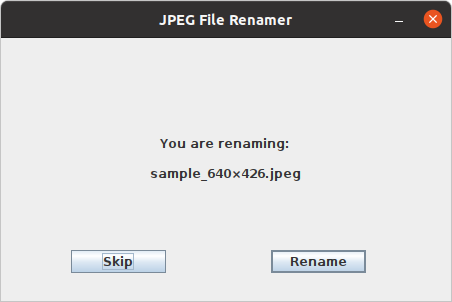

# JPEG-Metadata-Renamer

This JAVA tool scans all JPEG-files in a given directory, determines the timestamp based on the metadata of each file, and renames them to the format YYYY-MM-DD hh:ss (Year-Month-Day Hour-Second). 

## Describtion

Many modern devices such as smartphones or cameras are able to take and save pictures in JPEG-format. Depending on the operating system and version the naming of these pictures in the device files system is different (Timestamps, IMGx, DSCPy etc.). Many users collect their pictures from different devices in one common folder on their PC. The different naming conventions prevent an easy and useful ordering by filenames in this folder. The JPEG-format defines so called metadata (see  [Exchangeable_image_file_format](https://en.wikipedia.org/wiki/Exchangeable_image_file_format)). These metadata contain a timestamp when the picture was taken.

## Main Window

## Error, no valid file or directory path

## Confirmation Window

## Error, no timestamp found

## Completion View

